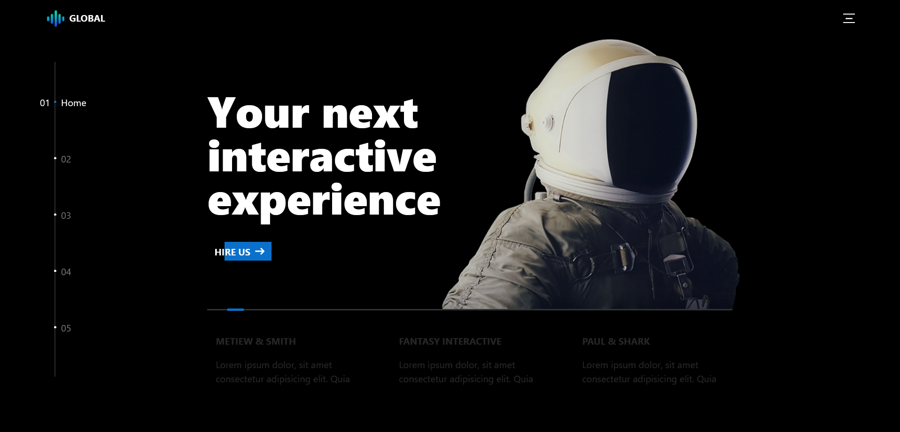
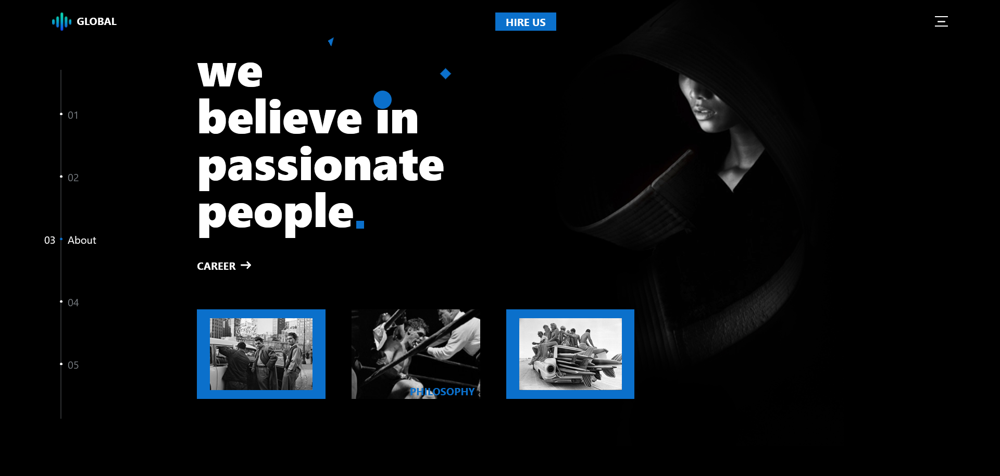
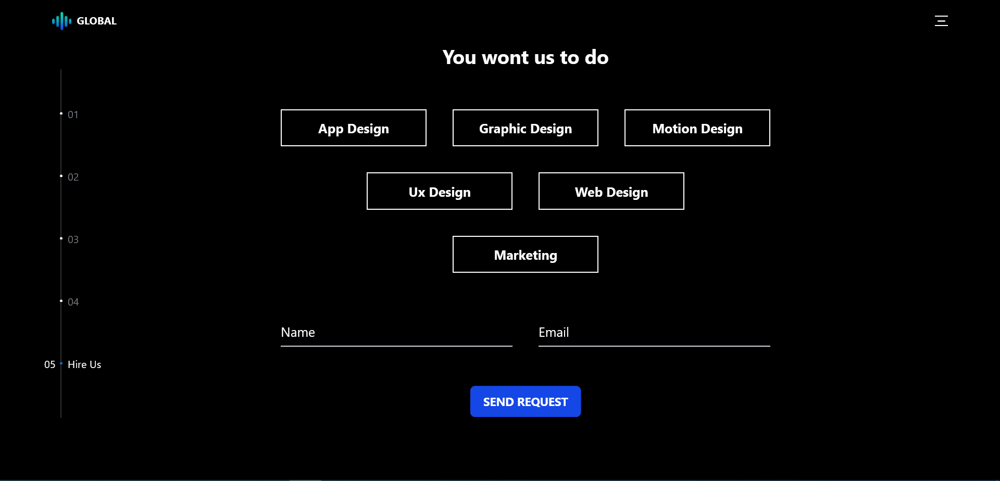
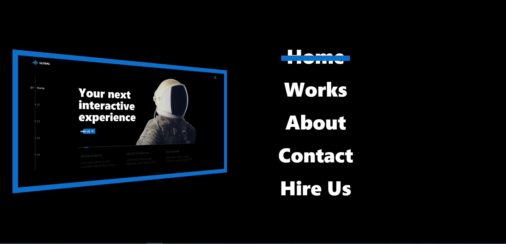
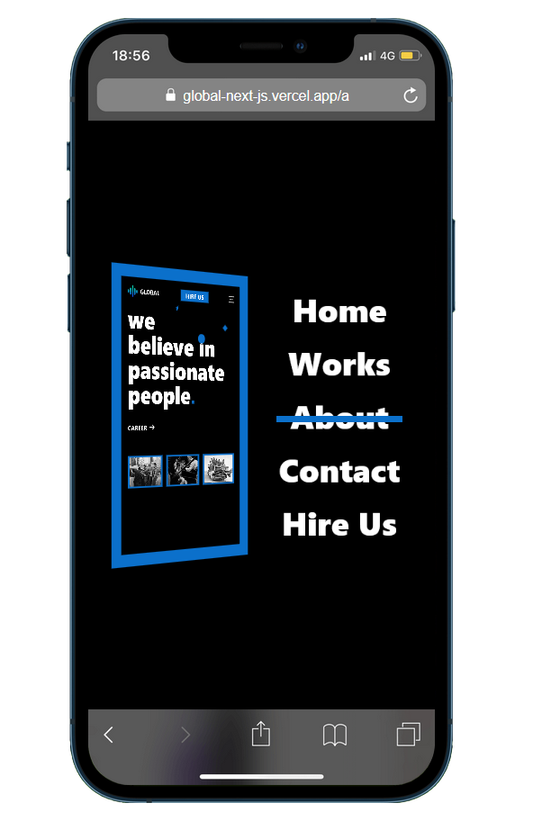
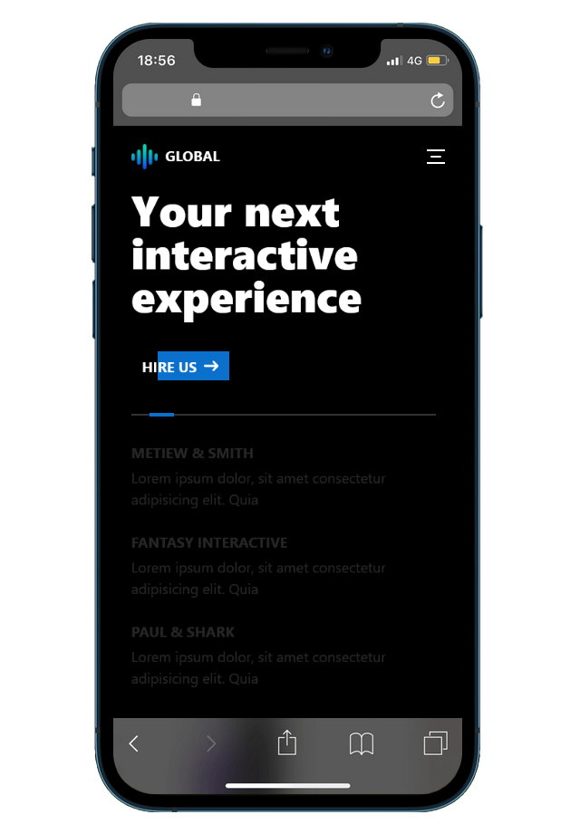

# 🌐 Global Portfolio Interface (Next.js)

This is a modern portfolio interface built with **Next.js 15+ App Router** and **Tailwind CSS**, featuring a unique 3D sidebar navigation behavior using mouse scroll and keyboard keys.

# [live demo](https://global-next-js.vercel.app/).

---
<p align="center">
  
  
</p>



## 🚀 Tech Stack

- **Next.js 15+ (App Router)**
- **TypeScript**
- **Tailwind CSS**
- **React Context API**
- **Slick Carousel**
- **Responsive Design (Mobiles + Tablets + Desktops)**

---

## 🎯 Features

### 🔁 Sidebar Navigation

- Smooth 3D transform effect using custom CSS and Tailwind.
- Toggle sidebar open/close using a hamburger menu in the navbar.
- Navigate between pages using:
  - **Arrow Up / Down keys**
  - **Mouse Scroll (Up/Down)**
- When a link is clicked in the sidebar, it updates the internal index for correct navigation.


### 📱 Responsive Design

- Navbar and sidebar layout adjust based on screen size (hidden sidebar on small screens).
- Custom button and animation design for a premium UI experience.
<p align="center">
  
  
</p>


---

## 🧠 Context API Integration

Global sidebar state (`isOpen`) is managed via React Context:

```ts
type SidebarContextType = {
  isOpen: boolean;
  setIsOpen: React.Dispatch<React.SetStateAction<boolean>>;
};
